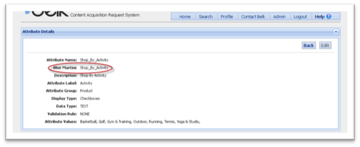

About
===

This DOC is designed to  guide you through the facet process. This doc will inform you of how to set up a new facet from beginning to end.You will also find information here to help you edit a pre-existing facet.

*Current working version: [1.0.061614]*

Creating A New Rule Attribute  
===
When creating a rule using an attribute that hasn’t been used on the site before, the process is as follows:

* Apply new attribute to appropriate products in CARS
*  Create rule using the new attribute 
*  `NOTE` – In order for the rule to work correctly, the attribute must exactly match         the `Blue Martini` value within CARS `Attribute Details` (circled below). The Attribute Label only affects the display label within CARS, and may or may not correspond with the actual attribute name.



* Send to Producer partner to create folder in Blue Martini using the new rule
* Once in Blue Martini, it is a two day wait before the assortment will populate (one day for Blue Martini to recognize the attribute, then another for Endeca to generate the products).
* Once the attribute is recognized by Blue Martini, any rules using the attribute can be tested using the Assortment Preview tool.


### Tips and Tricks


* There must be exactly one space between items inside square brackets (no spaces or multiple spaces will cause the entire rule to break).
* Any brand names must exactly match what is provided in CARS (special characters, including trademark and registry symbols, must be entered using their HTML equivalent)
* i.e. “Levi’s®” must be entered as “Levi’s&reg;”, “M·A·C” must be entered as“M&#183;A&#183;C”



Creating A New Facet Attribute
===

1.	Merchant requests new attribute to be created by CARS team with attribute category and list of values, and designate that it is intended for faceted navigation (get list of complete requirements from Allyson and turnaround time)
2.	Once attribute is created, notify Production and IT to coordinate mapping in Endeca (need turnaround time from IT)
3.	 If applying attribute to existing products, these CARS will need to be resync’d and resent to CMP (turnaround time dependent on number of products that need to be resent)
4.	Assign testing schedule to test new facet in Primary (Tuesday and Wednesday)
      - Producer configures new facet for designated categories after Endeca partial extraction completes, to eliminate risk of deploying to live site
      - Merchant testing between hours of 11-4 to ensure facets and assortments are behaving as expected
      - After testing is complete, producer removes facet before nightly index
5.	GOMEZ testing (subject to change)
6.	Producer configures facet to go live with next index

