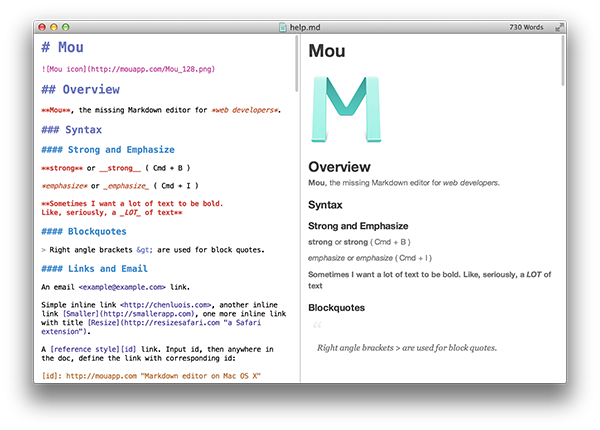
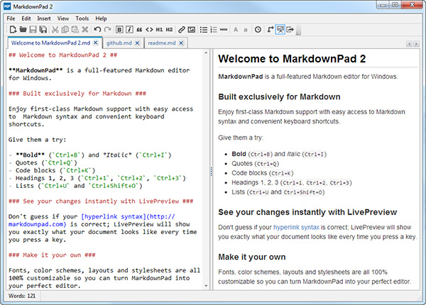

About
===

This DOC is designed to  guide you through the facet process. This doc will inform you of how to set up a new facet from beginning to end.You will also find information here to help you edit a pre-existing facet.
*Current working version: [1.0.]*


Creating New Facet Attribute
===

A Quick Outline
---

Here is a quick run down of how to use magnificent to generate your magnificent documentation. Each section will be explained in more detail further down.

1. Write your documentation, in the file located in /magnificent/documentation/Readme.md

2. Generate your documentation using the tool provided in magnificent/tools/ and update your Readme.js file.

3. Finally, update your config options  in magnificent/documentation/config.js (optionally add your own  background image or video)

And just like that, you have magnificent documentation!

Now you can include the documentation folder with your product or service.


Writing Your Docs
===

The Basics
---

Writing your documentation is super easy. By leveraging the markdown language (text files ending in .md) we can edit a single text file to create our documentation.

To get started you can simply open up the Readme.md file located in magnificent/documentation/Readme.md. You can open this file in any text editor or you can use a [free and simple Markdown](http://mouapp.com/) app like



for Mac or [Markdown pad for PC](http://markdownpad.com/)



The contents in that file are the contents that we used to build this documentation.

Creating a Section
---

To create a top-level section like this, you would use the following syntax in the Readme.md file:

```html
	Writing Your Docs
	===
```
That is your headline and the next line is 3 equal marks.

Creating Sections
---
To create a section, you would use the following syntax in the Readme.md file:

```html
	Creating Sections
	---
```
That is your section and the next line is 3 dashes.

### Creating a Subsection

To create a sub-section, you would use the following syntax in the Readme.md file:

```html
	### Creating a Subsection
```
That is your sub-section previous three characters are '#'.


Creating code blocks
---

creating code blocks like the one above, you would use the following:

```
 ` ` `
```

 three forward accent keys without spaces and three accent keys after the code block.

and that is your code block.

creating buttons
---

To create buttons you can use the following syntax

If your link text has a `>` at the end (for instance: `[I'm a button bitch >](http://magnificent.devdojo.com)`), they show
up as buttons.

[I'm a button bitch >](http://magnificent.devdojo.com)

further reading
---

We're not going to show you every bit of writing in Markdown language since there are so many great resources out there that can teach you every bit you need to know, or you can always use the default Readme.md and modify it to display your documentation.

Click the link below to learn all the elements of using the Markdown language:

[Learn More about Mark Down >](https://github.com/adam-p/markdown-here/wiki/Markdown-Cheatsheet)


Generating your docs
===

Why do you need to use the tools
---

Using the tool provided you can create your documentation and make it ready for your users in a snap.

We could always load the Readme.md file into HTML and show it that way, but if you wanted to provide this documentation in your product and allow your user to be able to open it even without an internet connection you'll have to load your Readme into a local JavaScript file. Which is why we created a simple tool for that.


Using the magnificent tool
---

To use the tool you can simply open up /magnficent/tools/index.html. When you open it up you will can enter in your Readme.md text file. Then the output will be displayed in the output textarea. Be sure to copy this for the next step.


Updating your Readme.js file
---
Next, you'll need to open and paste the text you've just copied into the file located in /magnificent/documentation/Readme.js.

And that's it. You should be able to open the file located in magnificent/documentation/Readme.html and your new documentation is ready for your users.

You may want to configure your documentation to fit your products needs and look. Keep reading the next section on configuring your documentation.

Configuring your docs
===

To configure your documentation you will open up the following file

/magnificent/documentation/config.js

And you should see the following options:

```
var magnificent = {

  headline : "Magnificent Documentation",
  name : "Magnificent 1.0",
  short_description : "A beautiful way to present your documentation",
  primary_button_url : "http://devdojo.ticksy.com",
  primary_button_text : "Support Center",
  // Look for the icon name here: http://fontawesome.io/icons/
  primary_button_icon : "fa-book",
  color_scheme : 'light',
  color : '#F35656',

  view_documentation_button_text : "",

  video_background : true,

  // Each menu item has an associated URL below. Separate each with commas
  menu_items 			: 	'View on Github, Issues, API Ref',
  menu_item_urls 		: 	'http://www.tonylea.com, http://www.facebook.com, http://www.devdojo.com',

  // Optional social URL's (if left blank, they will not be displayed)
  facebook				:	'http://www.facebook.com/thedevdojo',
  twitter				: 	'http://www.twitter.com/thedevdojo',
  google_plus			: 	'',
  instagram				: 	'',
  pinterest 			: 	'http://www.pinterest.com/devdojo',
  linkedin				: 	'',
  dribbble				: 	'',
  github				: 	'http://www.github.com/thedevdojo',

}
```

Simply change the value of the configuration you wish to make. (Note) leaving the value blank will either hide the element or show a default)

After you are done making your changes you'll want to save the file and reload your documentation to see the changes.

Additional Customization
===

You may also wish to add your own background image or video based on whichever setting you have chosen.

To change the background image you can simply replace the file located in:

/magnificent/documentation/background.jpg

or change the video files located in

/magnificent/documentation/video (You may want to replace all the video files to support all browsers)
